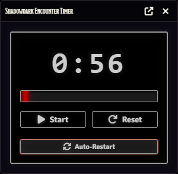

# Shadowdark Encounter Timer

A Foundry VTT module that adds an automated countdown timer to the Shadow Dark Crawl Helper, automatically triggering random encounter checks when time expires.

## Features

- **Automated Encounter Checks**: Countdown timer automatically triggers random encounter checks via Shadow Dark Crawl Helper
- **Auto-Restart Option**: Timer can automatically restart after completing, creating continuous encounter pressure
- **Combat Integration**: Optionally pause the timer when combat starts and resume when it ends
- **Crawl Round Integration**: Advance the crawl round when the timer completes
- **Configurable Duration**: Set timer length from 1-60 minutes (default: 10 minutes)
- **GM-Only Interface**: Timer and controls visible only to GMs
- **Visual Progress Bar**: Clear visual indicator of time remaining
- **Persistent Timer**: Timer continues running even when the window is closed

## Screenshots

### Timer Window


*The encounter timer with start/pause, reset, and auto-restart controls*

## Installation

Install using the module manifest URL in Foundry VTT:

```
https://github.com/m3rl1n0f4mb3r/shadowdark-encounter-timer/releases/latest/download/module.json
```

1. In Foundry VTT, go to "Add-on Modules" → "Install Module"
2. Paste the manifest URL into the "Manifest URL" field
3. Click "Install"
4. Enable the module in your world under "Manage Modules"

**Required Module**: [Shadow Dark Crawl Helper](https://github.com/PrototypeESBU/foundryvtt-shadowdark-crawl-helper) - This module extends Crawl Helper's functionality

## Usage

### Opening the Timer

As GM, click the clock icon in the Token Controls toolbar (left sidebar) to open/close the timer window.

### Controls (GM Only)

- **Start/Pause Button**: Begin or pause the countdown
- **Reset Button**: Reset the timer to the configured duration
- **Auto-Restart Toggle**: Enable/disable automatic timer restart after completion

### Timer Behavior

1. **Initial Start**: Click Start to begin the countdown from the configured duration
2. **Timer Complete**: When time expires:
   - If in a Crawl Helper crawl combat and "Advance Crawl Round" is enabled: advances the crawl round (Crawl Helper handles the encounter check)
   - Otherwise: triggers an encounter check directly via Crawl Helper
3. **Auto-Restart**: If enabled, timer automatically restarts 2 seconds after completion
4. **Combat Pause**: If enabled, timer pauses when combat starts and resumes when it ends

### Module Settings

Configure in Game Settings → Module Settings:

- **Timer Duration**: Length of countdown in minutes (1-60, default: 10)
- **Pause on Combat Start**: Automatically pause when combat begins
- **Resume After Combat**: Automatically resume when combat ends
- **Advance Crawl Round on Timer Reset**: Advance the crawl round when timer completes

## Compatibility

- **Foundry VTT**: Minimum v13, verified on v13
- **Required Module**: Shadow Dark Crawl Helper (v1.0.0+)

## How It Works

The module integrates with Shadow Dark Crawl Helper's encounter system:

- **During Crawl Combat**: If "Advance Crawl Round" is enabled and you're in a crawl-type combat, the timer advances the crawl round when it expires. Crawl Helper then handles the encounter check based on its configured frequency.
- **Outside Crawl Combat**: The timer directly triggers Crawl Helper's encounter check system.
- **Timer Persistence**: The timer continues running in the background even when the window is closed, maintaining encounter pressure throughout your session.

## Debug Mode

This module supports Developer Mode for debug logging. Enable "shadowdark-encounter-timer" in Developer Mode to see detailed console logs.

## Support

- **GitHub Issues**: https://github.com/m3rl1n0f4mb3r/shadowdark-encounter-timer/issues
- **Discord**: m3rl1n0f4mb3r

## Credits

**Module Developer**: Merle Corey (m3rl1n0f4mb3r)

**Shadow Dark Crawl Helper**: Created by PrototypeESBU

**Shadowdark RPG**: Created by Kelsey Dionne at [The Arcane Library](https://www.thearcanelibrary.com/)

## License

This Foundry VTT module is licensed under the [MIT License](./LICENSE).

This work is licensed under Foundry Virtual Tabletop [EULA - Limited License Agreement for Module Development](https://foundryvtt.com/article/license/).

---

**Version 1.0.0** - Initial Release